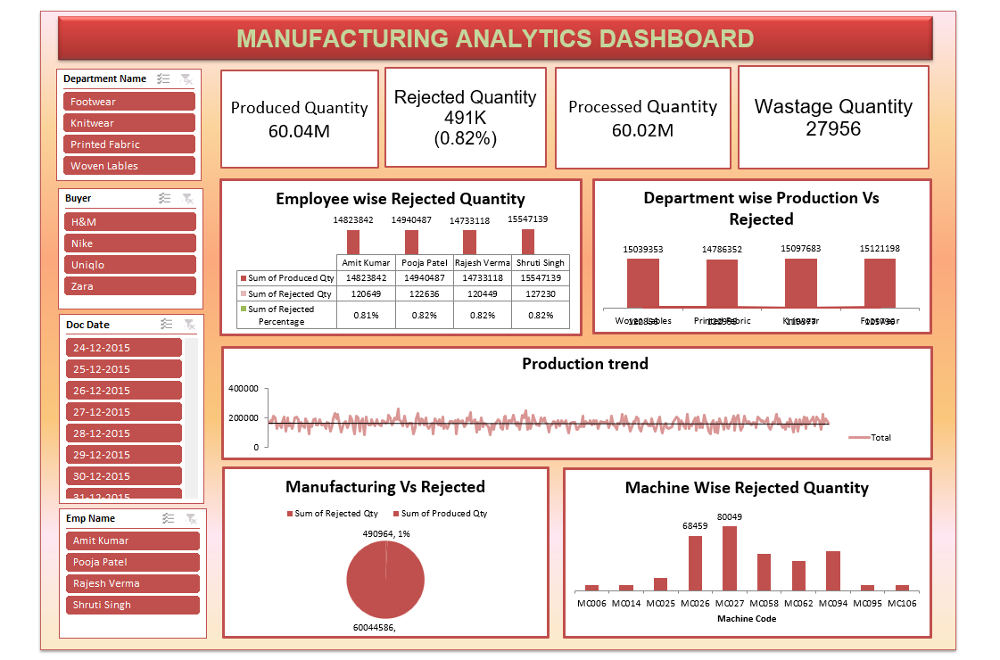
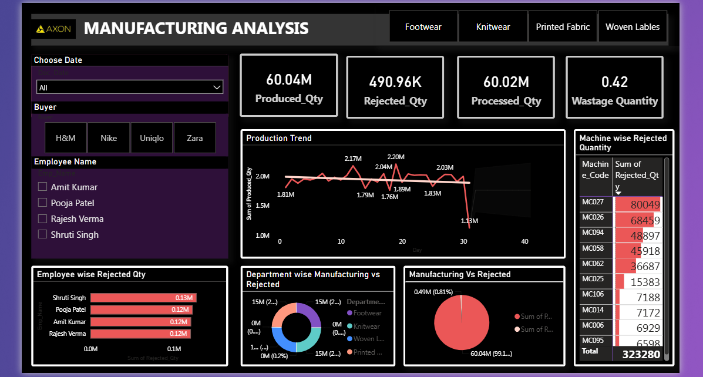
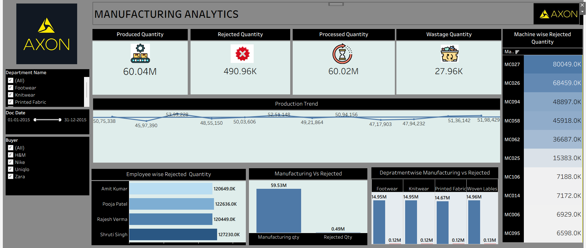

# Manufacturing Analytics Dashboard

## Project Overview

This project was completed as part of the ExcelR Data Analytics Training Program. The objective was to analyze manufacturing operations data and identify opportunities to improve production efficiency, reduce rejection rates, minimize wastage, and optimize overall operational performance.

The project leverages SQL, Microsoft Excel, Power BI, and Tableau to transform raw manufacturing data into meaningful insights through interactive dashboards and KPI-driven analysis.

## Tools Used

* SQL
* Microsoft Excel
* Power BI
* Tableau

## Project Type

Industry-Oriented Data Analytics Project completed during a 3-Month Data Analytics Internship at AI Variant through the ExcelR Training Program.

## My Contributions

* Performed data cleaning and transformation
* Developed SQL queries for data analysis
* Created KPIs to measure manufacturing performance
* Built dashboards using Microsoft Excel, Power BI, and Tableau
* Analyzed production efficiency, rejection rates, and wastage metrics
* Generated business insights and recommendations
* Contributed to project documentation and presentation

## Key Performance Indicators (KPIs)

* Manufactured Quantity
* Processed Quantity
* Rejected Quantity
* Wastage Quantity
* Machine-wise Rejected Quantity
* Employee-wise Rejected Quantity
* Production Comparison Trend
* Manufacturing vs Rejected Quantity
* Department-wise Manufacturing vs Rejection

## Dashboard Screenshots

### Excel Dashboard

### Power BI Dashboard

### Tableau Dashboard

## Key Insights

* Production efficiency exceeded 99%, indicating strong operational performance.
* Rejection rates remained below 1%, reflecting effective quality control.
* Machine-wise analysis identified equipment contributing to higher rejection volumes.
* Department-wise analysis highlighted opportunities to reduce wastage and improve productivity.
* KPI-driven dashboards enabled better monitoring of manufacturing performance and decision-making.

## Repository Contents

* SQL Queries
* Excel Dashboard
* Power BI Dashboard
* Tableau Dashboard
* Dashboard Screenshots

## Business Recommendations

* Implement predictive maintenance for high-rejection machines.
* Strengthen quality control processes to further reduce defects.
* Monitor department-wise performance to identify improvement opportunities.
* Use KPI dashboards for continuous operational monitoring and decision-making.
